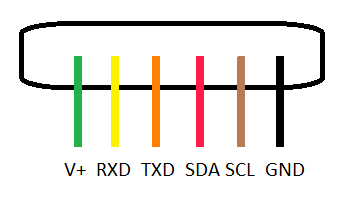

# Introduction
This library is for the Encoder DC Servo Motor: RMCS220x (reference [here](https://robokits.co.in/motors/high-torque-encoder-dc-servo-motor-10rpm-with-uart-i2c-ppm-drive?cPath=364_366_376&)).

# Index
- [Introduction](#introduction)
- [Index](#index)
- [Users Guide](#user-guide)
    - [Downloading the library](#downloading-the-library)
    - [Using the library with Arduino](#using-the-library-with-arduino)
- [Library Explanation](#library-explanation)
  - [Examples](#examples)
      - [RhinoSerial](#rhinoserial)
      - [RhinoI2C](#rhinoi2c)
      - [RhinoSoftSerial](#rhinosoftserial)
- [Developers Guide](#developers-guide)
    - [Library Details](#library-details)
    - [Class contents](#class-contents)
        - [Private members](#private-members)
            - [Variables](#variables)
            - [Member functions](#member-functions)
        - [Public members](#public-members)
            - [Constructors](#constructors)
            - [Member functions](#member-functions-1)
- [References](#references)

# User guide
## Downloading the library
It is suggested that you download the entire repository and then select this folder, so that you can enjoy the benifits of VCS like git. It makes it simpler to update the contents whenever patch fixes are done. You can simply open a terminal (or gitbash on windows), go to the folder where you want to save this repository and type the following command.
```
  git clone https://github.com/shashank3199/RhinoServo
```

**Not recommended**: You can download _only_ this folder by clicking [here](https://minhaskamal.github.io/DownGit/#/home?url=https://github.com/shashank3199/RhinoServo)

## Using the library with Arduino
Move this folder into the arduino libraries folder on your PC. If you don't know where the libraries folder of your arduino is, you can click [here](https://www.arduino.cc/en/hacking/libraries).<br>
Also, this Library makes use of the DebuggerSerial Library. For More Information on this, click [here](https://github.com/RoboManipal-9-0/Libraries/tree/master/DebuggerSerial).

In order to use this library, you must do the following:
- Include the header file `RhinoServo.h` (the *RhinoServo* library folder must be in your arduino libraries folder).
- Create an object of class `RhinoServo`. You can pass the constructor parameters to initialize here itself, or leave it as a simple object declaration.
- For SERIAL Mode: Initialize the Serial on which the Rhino is attached using the `AttachRhino_Serial` function.
- For I2C Mode: Initialize the Rhino on I2C using the `AttachRhino_Address` function.

You may optionally initialize and attach a debugger serial as well (using `debugger.Initialize` function on the object). You can access the debugger using the `debugger` variable of the class.

# Library Explanation
The Library uses the Rhino with the following Pin Out -



## Examples

Note: The Rhino Motors work on 9600 BaudRate.

### RhinoSerial
This example show you to work with the Rhino using the `RhinoServo` library on Serial3.<br>
File: [./examples/RhinoSerial/RhinoSerial.ino](./examples/RhinoSerial/RhinoSerial.ino)<br>

We simply follow the following steps:
1. Include library
2. Create object
3. Initialize Serials. RhinoServo on **Serial3** and debugger on **Serial**. Keep in mind to match the baud rates.
4. Initialize debugger. Name it `Rhino`.
5. Then start a loop
    1. Use the Commands as described by the Comments.
    2. The Format for the Commands are - <br>

        < Command Variable > < Parameter Value > <br>
        Eg - <br>
        "M450" : Moves the Motor to Encoder Value 450 <br>
        "m90"  : Moves Relative to the Current Position by 90 Degrees.
    3. The Values will be printed by the Debugger Object.
6. Re-run the loop

```
[0] > Debugger enabled
[1] > DebuggerSerial attached
[6827 DEBUG] $Rhino$ Encoder value Reset.
[13472 DEBUG] $Rhino$ Motor Moved to Position: 450
[18271 DEBUG] $Rhino$ Motor Moved Relative to the Old Position by: -45 Degrees.
[35073 DEBUG] $Rhino$ Motor Moved Relative to the Old Position by: 135 Degrees.
[42457 DEBUG] $Rhino$ Motor Moved to Position: 0
[53172 INFO] $Rhino$ Rhino I2C Address changed to: 31
```

### RhinoI2C
This example show you to work with the Rhino using the `RhinoServo` library on I2C Communication.<br>
File: [./examples/RhinoI2C/RhinoI2C.ino](./examples/RhinoI2C/RhinoI2C.ino)<br>

We simply follow the following steps:
1. Include library
2. Create objects R1 and R2.
3. Initialize Objects with their Respective Addresses (For finding I2C Addresses, connect via Serial mode First and Set the Addresses Or to check for the Existing Addresses use [I2C Scanner](https://playground.arduino.cc/Main/I2cScanner)). Debugger on **Serial**.
4. Initialize debuggers. Name it `Rhino 1` and `Rhino 2`.
5. Then start a loop
    1. Use the Commands as described by the Comments.
    2. The Format for the Commands are - <br>

      < Command > < motor_number > # < parameter_value > <br>
      Eg - <br>
      "M1#200" : Moves `Motor 1` to Encoder Position 200. <br>
      "m2#180" : Moves `Motor 2` by 180 Deg Relative to Current Position.
    3. The Values will be printed by the Debugger Object.
6. Re-run the loop

```
[0] > Debugger enabled
[0] > DebuggerSerial attached
[1 INFO] $Rhino 1$ Rhino Attached on I2C Rhino Address: 31
[52] > Debugger enabled
[77] > DebuggerSerial attached
[111 INFO] $Rhino 2$ Rhino Attached on I2C Rhino Address: 32
[4111 DEBUG] $Rhino 1$ Encoder value Reset.
[10142 DEBUG] $Rhino 1$ Motor Moved to Position: 450
[17900 DEBUG] $Rhino 1$ Motor Moved Relative to the Old Position by: -90 Degrees.
```

### RhinoSoftSerial
This example show you to work with the Rhino using the `RhinoServo` library on RhinoSerial on .<br>
File: [./examples/RhinoSoftSerial/RhinoSoftSerial.ino](./examples/RhinoSoftSerial/RhinoSoftSerial.ino)<br>

We simply follow the following steps:
1. Include library
2. Create object
3. Create a Software Serial on Pins 10 and 11 named RhinoSerial. Set the RhinoServo object on **RhinoSerial** and debugger on **Serial**. Keep in mind to match the baud rates.
4. Initialize debugger. Name it `Rhino`.
5. Then start a loop
    1. Use the Commands as described by the Comments.
    2. The Format for the Commands are - <br>

        < Command Variable > < Parameter Value > <br>
        Eg - <br>
        "M450" : Moves the Motor to Encoder Value 450 <br>
        "m90"  : Moves Relative to the Current Position by 90 Degrees.
    3. The Values will be printed by the Debugger Object.
6. Re-run the loop

```
[0] > Debugger enabled
[1] > DebuggerSerial attached
[6827 DEBUG] $Rhino$ Encoder value Reset.
[13472 DEBUG] $Rhino$ Motor Moved to Position: 450
[18271 DEBUG] $Rhino$ Motor Moved Relative to the Old Position by: -45 Degrees.
[35073 DEBUG] $Rhino$ Motor Moved Relative to the Old Position by: 135 Degrees.
[42457 DEBUG] $Rhino$ Motor Moved to Position: 0
[53172 INFO] $Rhino$ Rhino I2C Address changed to: 31
```

# Developers guide

## Library Details
### Files in the Library
The files in the library are:

#### RhinoServo.h
This is the Header file and contains the Class Blueprint (Prototype).

#### RhinoServo.cpp
This file contains the Definition for the Class Member Functions Prototyped in the Header File.

#### README.md
The Description file containing details about the library. The file that you looking at right now.

# Class Contents
Let's explore the contents of the class, but first, we also have literals defined for general purpose use (using `#define`). They are:

| Name | Value | Purpose |
|:----:| :----: | :----- |
| MODE_SERIAL| 0 | Value passed to select Serial Mode of Operation. |
| MODE_I2C | 1 | Value passed to select I2C Mode of Operation. |

| Macro Name |  Purpose |
|:----:|  :----- |
| DEGtoCOUNT(x) | Converts Degrees Passed to Encoder Count Value |

Let's explore the class now

### Private members

##### Variables
- **<font color="#CD00FF">int</font> connection_mode**: Mode for Rhino Operation.
- **<font color="#CD00FF">Stream\*</font> Rhino_Serial**: This is the Serial Line on which the Rhino operates.
- **<font color="#CD00FF">uitn8_t</font> Rhino_Address**: This is the I2C Address for Communication to the Rhino.

#### Member functions
- **<font color="#CD00FF">int </font><font color="#5052FF">read</font> ( )** : To recieve values from the Rhino in the Respective Formats.
- **<font color="#CD00FF">void </font><font color="#5052FF">toBytes</font> (<font color="#FF00FF">int</font> val,<font color="#FF00FF">int</font> arr[]   )** : Converts integer Values to corresponding Byte Format.

### Public members
#### Members
- **<font color="#CD00FF">DebuggerSerial</font> debugger**: The debugger for the class. Check the [DebuggerSerial documentation](https://github.com/RoboManipal-9-0/Libraries/tree/master/DebuggerSerial) for more on this.

#### Constructors
- **<font color="#5052FF">RhinoServo</font> ( )** : Empty constructor for the class.
- **<font color="#5052FF">RhinoServo</font> (<font color="#FF00FF">int </font> connection_mode )** : Constructor to set the Communication for the class.
- **<font color="#5052FF">RhinoServo</font> (<font color="#FF00FF">Stream\*</font> AttachedSerial )** : To attach a pre-initialized serial to the Rhino. This function calls the _AttachRhino_Serial_ member function.
- **<font color="#5052FF">RhinoServo</font> (<font color="#FF00FF">uint8_t </font> Rhino_Address )** : To attach the I2C Address for the Rhino. This function calls the _AttachRhino_Address_ member function.

#### Member functions

- **<font color="#CD00FF">void</font> AttachRhino_Serial ( <font color="#FF00FF">Stream\*</font> AttachedSerial )** : Attach Serial Line for the Rhino.
- **<font color="#CD00FF">void </font> AttachRhino_Address ( <font color="#FF00FF">uint8_t </font> Rhino_Address )** :  Attach I2C Address to the Rhino.
- **<font color="#CD00FF">void </font> Set_Dir_Speed (<font color="#FF00FF">int </font> val )** :  Set Direction and Speed for Constant Rotation (Values between -255 to +255).
- **<font color="#CD00FF">void </font> SetI2C_Address ( <font color="#FF00FF">int </font> val )** :  Set I2C Address (Serial Mode Only).
- **<font color="#CD00FF">void </font> Set_P_Gain (<font color="#FF00FF">int </font> val )** :  Set Proportional Gain term for PID Correction (Values between 0 to 32767).
- **<font color="#CD00FF">void </font> Set_I_Gain (<font color="#FF00FF">int </font> val )** :  Set Integral Gain term for PID Correction (Values between 0 to 32767).
- **<font color="#CD00FF">void </font> Reset_Reference ( <font color="#FF00FF">int </font> val=0 )** :  Set Encoder Value to a Specific Value (or Zero Value if not supplied with any Parameter).
- **<font color="#CD00FF">void </font> Reset ( )** :  Resets the Rhino Motor to Factory Defaults.
- **<font color="#CD00FF">void </font> Moveto ( <font color="#CD00FF">int </font> val )** :  Move to Encoder Position wrt Encoder Zero Position.
- **<font color="#CD00FF">void </font> MovetoRel ( <font color="#CD00FF">int </font> val )** :  Move to Position Relative to Current Position.
- **<font color="#CD00FF">int </font> GetCurrent_Position( )** : Get Position Value from the Encoder.
- **<font color="#CD00FF">int </font> Get_P_Gain( )** : Get Proportional Gain value for the PID Correction.
- **<font color="#CD00FF">int </font> Get_I_Gain( )** : Get Integral Gain value for the PID Correction.
- **<font color="#CD00FF">int </font> GetI2C_Address( )** : Display Address of the Rhino (Serial Mode Only).

# References
- [Rhino User Manual](./extras/RMCS220x_DCServo_Driver.pdf).

[](https://github.com/shashank3199)
